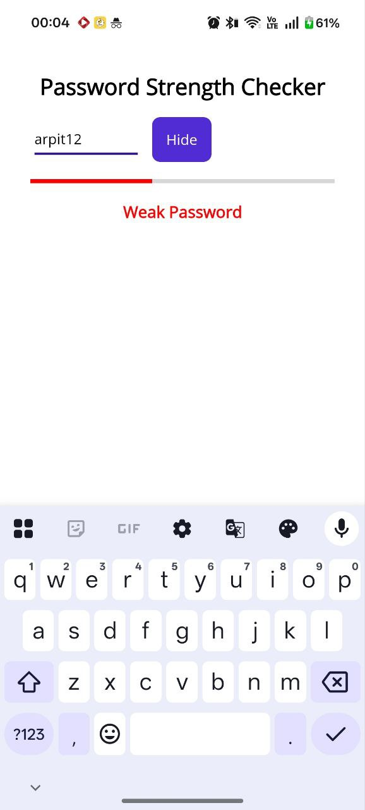
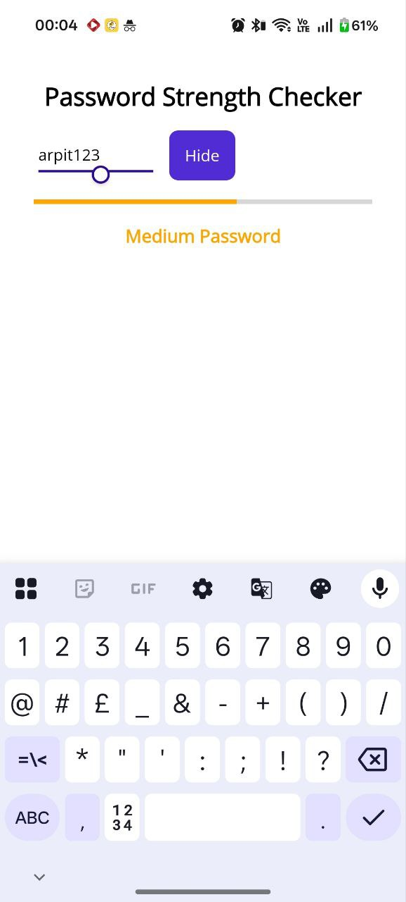
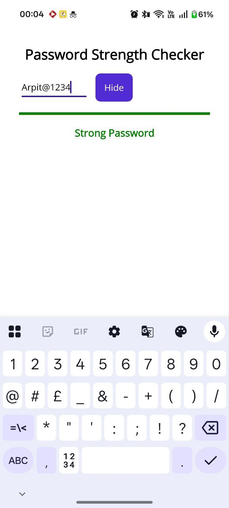

# 🔐 Password Strength Checker – .NET MAUI

A cross-platform password strength checker application built using **.NET MAUI** and **C#**.  
The app provides real-time feedback on password strength using visual indicators and validation rules.

---

## 📱 Features

- Real-time password strength evaluation  
- Progress bar based strength indicator  
- Color feedback (Weak / Medium / Strong)  
- Show / Hide password functionality  
- Cross-platform support (Android, Windows, iOS)

---

## 📸 App Screenshots

### Weak Password


### Medium Password


### Strong Password


---

s## 🛠️ Tech Stack

- .NET MAUI  
- C#  
- XAML  
- Android Emulator / Physical Device

---

## 🧠 Password Strength Criteria

The password strength is evaluated based on:
- Minimum length (8 characters)
- Uppercase letters
- Lowercase letters
- Numbers
- Special characters

---

## 🚀 How to Run the Project

1. Clone the repository  
   ```bash
   git clone https://github.com/<your-username>/password-strength-checker-maui.git
